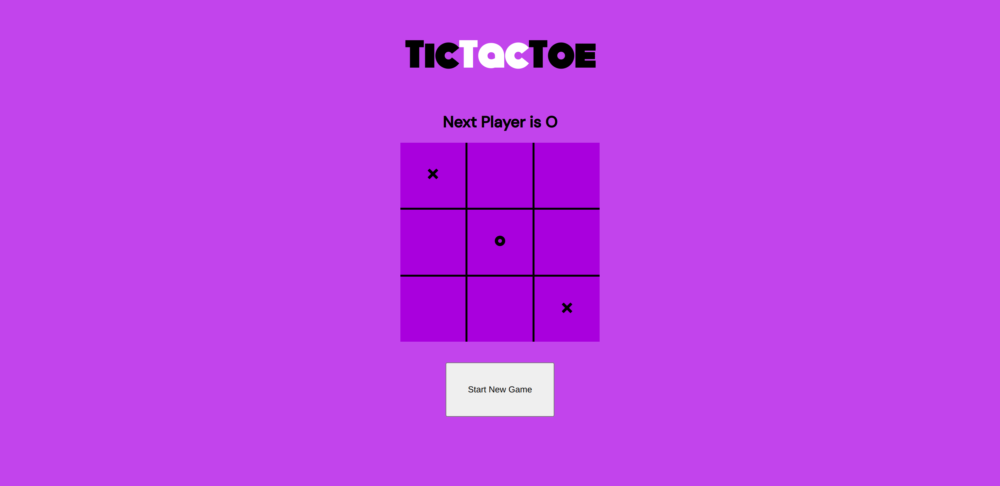

# Tic-Tac-Toe Game

A simple and fun Tic-Tac-Toe game built with **React.js**. Play as `X` or `O` and take turns to mark your move on the grid!

## ✨ Features

- **Two-player game**: Alternate between `X` and `O` players.
- **React.js**: Built using functional components and state management.
- **Reset Button**: Start a new game anytime with a click of a button.
- **Responsive**: Works across devices with a minimalistic design.

## 🚀 Getting Started

Follow these steps to run the project locally.

### Prerequisites

- **Node.js** (v14.17 or higher)
- **npm** or **yarn**
